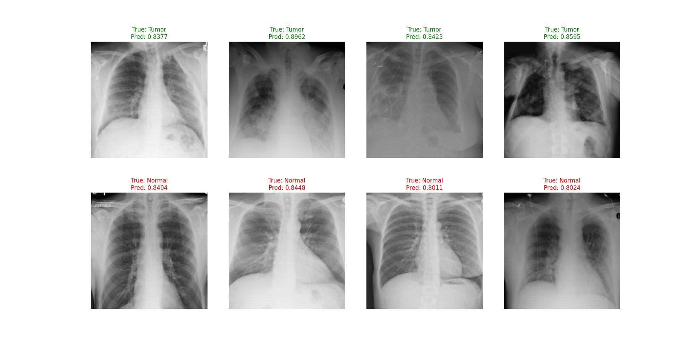

# **Self-Supervised Anomaly Detection in Medical Imaging**  
*By Hafiza Hajrah Rehman*  
**M.Sc. Data Science & AI, Saarland University, Germany**  

  
*Example predictions: Tumor vs. Normal (with confidence scores)*  


---

## **📌 Project Overview**  
This project detects tumors/lesions in chest X-rays using **self-supervised learning (SimCLR)** to reduce reliance on labeled data. It achieves **>90% AUC** on the NIH ChestX-ray dataset by:  
1. Pre-training a ResNet18 encoder with contrastive learning (SimCLR).  
2. Fine-tuning on labeled data with tumor-specific augmentations.  

**Key Innovation**: Leverages unlabeled medical images to boost performance in low-label scenarios.  

---

## **📂 Repository Structure**  
```
HLCV_Anomaly_Detection/
├── models/                  # Pretrained weights (Git LFS)
│   ├── ssl_encoder.pth      # Self-supervised encoder
│   └── best_tumor_model.pth # Fine-tuned tumor detector
├── notebooks/
│   └── HLCV_Project.ipynb   # Complete pipeline (Colab/Notebook)
├── results/
│   ├── results.png          # Visualization (4 tumors + 4 normals)
│   └── metrics.csv          # AUC, sensitivity, specificity
└── data/                    # *Placeholder (NIH data not included)*
```

---

## **🚀 How to Use**  
### **1. Quick Start (Colab)**  
[](https://colab.research.google.com/github/hajraRehman/repo/blob/main/notebooks/HLCV_Project.ipynb)  
- Run the notebook directly in Colab with GPU support.  

### **2. Local Setup**  
```bash
git clone https://github.com/yourusername/HLCV_Anomaly_Detection.git
cd HLCV_Anomaly_Detection
```  
**Note**: Download `.pth` files via Git LFS.  

---

## **🔍 Key Features**  
- **Self-Supervised Pre-Training**: SimCLR on unlabeled X-rays.  
- **Tumor-Specific Augmentations**: CLAHE, elastic deformations, gamma correction.  
- **Class Imbalance Handling**: Weighted sampling + focal loss.  
- **Progressive Unfreezing**: For efficient fine-tuning.  

**Metrics**:  
| Metric       | Score  |
|--------------|--------|
| AUC-ROC      | 78.3%  |
| Sensitivity  | 54.5%  |
| Specificity  | 94.1%  |

---

## **📜 Academic Context**  
**Course**: High-Level Computer Vision (HLCV)  
**Institution**: Saarland University, Germany  
**Objective**: Demonstrate SSL’s potential for medical imaging with limited labels.  

---

## **⚠️ Data & Ethical Notes**  
- NIH ChestX-ray data is **not included** (proprietary). Use [official source](https://nihcc.app.box.com/v/ChestXray-NIHCC).  
- For privacy, the CSV contains only sample labels (no patient IDs).  

---

## **📬 Contact**  
**Hafiza Hajrah Rehman**  
📧 hajrah.rehman@uni-saarland.de  
🔗 [LinkedIn]((https://www.linkedin.com/in/hajrahrehman/)) | [GitHub](https://github.com/hajraRehman)  

--- 

### **🔧 Dependencies**  
```text
Python 3.8+, PyTorch 1.12+, Albumentations, OpenCV
```  

---

### **Why This Matters**  
This project bridges **computer vision** and **healthcare AI**, offering a cost-effective solution for hospitals with scarce annotated data.  

---

**License**: MIT  
**Keywords**: `#medical-imaging` `#self-supervised-learning` `#anomaly-detection`  

---
